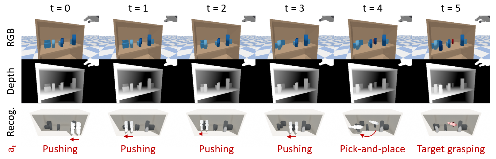
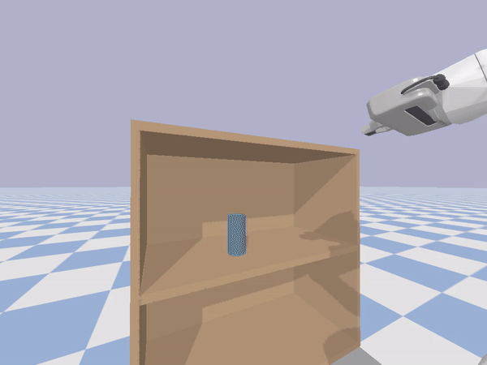
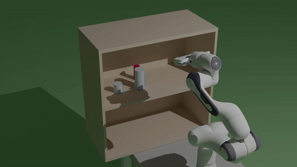
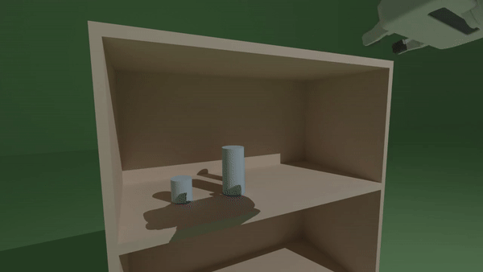

# Search-for-Grasp
The official repository for \<Leveraging 3D Reconstruction for Mechanical Search on Cluttered Shelves\> (Seungyeon Kim*, Young Hun Kim*, Yonghyeon Lee, and Frank C. Park, CoRL 2023).

> This paper introduces a novel framework for finding and grasping a target object using a standard gripper on cluttered shelves, employing pushing and pick and-place actions. 

- *[Paper](https://proceedings.mlr.press/v229/kim23a/kim23a.pdf)* 
- *[Supplementary video](https://www.youtube.com/watch?v=FoejNGHf1XM&t=2s)*
- *[Slides](https://drive.google.com/file/d/12B6Xd9QTmh-tj19Ddhc-OTpQF9nHDPcd/view?usp=drive_link)*
- *[Poster](https://drive.google.com/file/d/125g_tewVmJ0L1F-pEZBpRGNSHcpZs8Kw/view?usp=drive_link)*
- *[Openreview](https://openreview.net/forum?id=ycy47ZX0Oc)*

## Preview
### Mechanical Search on Cluttered Shelves

<I>Figure 1: An example trajectory of mechanical search. Each column shows the camera input and action selection at each time step. In the simulation, surrounding objects are blue and the target object is red. </I>

## Requirements
### Environment
The project is developed under a standard PyTorch environment.
- python 3.9
- pybullet 3.2.3
- pytorch
- matplotlib
- Open3D
- opencv-python
- dominate
- h5py
- pysimplegui
- urdfpy (np.float)
> **Warining:** If you get error "ImportError: cannot import name 'gcd' from 'fractions'", you can solve it by running `conda install -c conda-forge networkx=2.5`.

> **Warining:** If you get error "AttributeError: module 'numpy' has no attribute 'float'", you have to manually revise the code: change `np.float` to `float` in `urdf.py`. 

### Pretrained model
Pre-trained models should be stored in `pretrained/`. The pre-trained models are already provided in this repository. After set up, the `pretrained/` directory should be follows.
```
pretrained
├── segmentation_config
│   └── pretrained
│       ├── segmentation_config.yml
│       └── model_best.pkl
├── sqpdnet_config
│   └── pretrained
│       ├── sqpdnet_2d_motion_only_config.yml
│       └── model_best.pkl
└── recognition_config
    └── pretrained
        ├── recognition_config.yml
        └── model_best.pkl
```

## Running
### Control in Simulation Environment
The control script in PyBullet simulator is as follows:
```
python control.py --config configs/control_objects_{X}_config.yml
```
- `X` is either `2`, `4`, `6` or `8`. 
- `--enable_gui` specifies whether PyBullet UI is on or off. The value should be `True` or `False`.
- `--device` specifies an GPU number to use.
- By changing the `idx` value in the config file, you can see the mechanical search in other scenes. `idx` is an integer between 1 and 50.
- The experimental results will be saved in `save_dir` in the config file.
> **Warining:** Since the computation speeds of PyBullet are different on Linux and Windows, the experiment results are also different (especially behaves strangely when running on Windows). It is recommended to run the code on Linux.

### Spawn Object Sets for Experiments
The script for generating scenes in PyBullet simulator is as follows:
```
python spawn.py --config configs/spawn_config.yml
```
- `--enable_gui` specifies whether PyBullet UI is on or off. The value should be `True` or `False`.
- You can change the number of objects by changing the `num_objects` value in the config file. 
- The scenes will be saved in `save_dir` in the config file.

### Replay Episodes
The script for replaying experimental results in PyBullet simulator is as follows:
```
python replay_episode.py --config configs/replay_episode_config.yml
```
- You can see other meachanical search results by changing the `exp_name` value in the config file. The value should be the name of a result folder generated from control scripts (i.e., `control.py`). 
- A PyBullet `mp4` video and a `pkl` file for Blender video will be saved in `video_dir` and `save_dir` in the config file, respectively.
> **Warining:** If you get error "PyBullet unrecognized option 'preset'", you can solve it by running `conda update ffmpeg`.

Example result PyBullet `mp4` video is as follows:
<div class="imgCollage">
<span style="width: 100%"></span>
</div>
  <I>Figure 2: An example mechanical search video in PyBullet simulator.</I>

### Replay Episodes with Blender
The Blender rendering code is slightly modified from [pybullet-blender-recorder](https://github.com/huy-ha/pybullet-blender-recorder). This is tested on `Blender 4.0`. 

1. Install the blender plugin from [pybullet-blender-recorder](https://github.com/huy-ha/pybullet-blender-recorder). The `pyBulletSimImporter.py` is in `pybullet_blender` folder.

2. After running `replay_episode.py`, you can obtain a `pkl` file (e.g., `demo.pkl`). In the `Animation` tab on the side bar in Blender, click on `[Import simulation]` and navigate to the `pkl` file you want to import.

3. (Optional) You may use a template for Blender: *[test.blend](https://drive.google.com/file/d/1B6_CyCaQcZMQWseNboH18RcosRmm9n99/view?usp=sharing)*.

4. (Optional) If you use the template `test.blend` and replace the data with another `pkl` file, set `Target` to `shelf_for_blender_2_shelf_bottom_4` in `Track To` of `Constraints` of `Camera_L` and `Camera_X`.

5. Execute `Render > Render Anitaion`. Set the save folder before execution.

6. In the saved folder above, run the following codes in the terminal:
  ```shell
  ffmpeg -framerate 30 -pattern_type glob -i '*_L.png' -c:v libx264 -pix_fmt yuv420p out_L.mp4
  ffmpeg -framerate 30 -pattern_type glob -i '*_R.png' -c:v libx264 -pix_fmt yuv420p out_R.mp4
  ffmpeg -framerate 30 -pattern_type glob -i '*_X.png' -c:v libx264 -pix_fmt yuv420p out_X.mp4
  ```

Example Blender `mp4` videos taken from various angles are as follows:
<div class="imgCollage">
<span style="width: 31.8%"></span>
<span style="width: 31.8%"> </span>
<span style="width: 31.8%"> </span>
</div>
  <I>Figure 3. Example mechanical search videos taken from various angles in Blender.</I>

<!-- ### (Optional) Train Models
If you want to generate your own custom dataset, run the following script:
```shell
python data_generation.py --enable_gui                # PyBullet UI on/off
                          --folder_name test          # folder name of the generated dataset
                          --object_types box cylinder # used object types for data generation
                          --num_objects 4             # can be 1~4; currently the max number of object is 4
                          --push_num 20               # max number of pushing per sequence
                          --training_num 150          # the number of training set; total number of training set is (training_num * push_num)
                          --validation_num 15         # the number of validation set; total number of validation set is (validation_num * push_num)
                          --test_num 15               # the number of test set; total number of test set is (test_num * push_num)
```  -->

## Citation
If you found this repository useful in your research, please consider citing:
```
@inproceedings{kim2023leveraging,
  title={Leveraging 3D Reconstruction for Mechanical Search on Cluttered Shelves},
  author={Kim, Seungyeon and Kim, Young Hun and Lee, Yonghyeon and Park, Frank C},
  booktitle={Conference on Robot Learning},
  pages={822--848},
  year={2023},
  organization={PMLR}
}
```